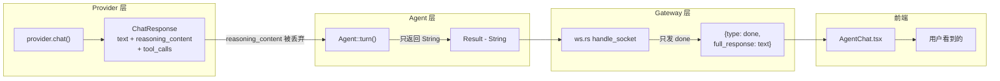
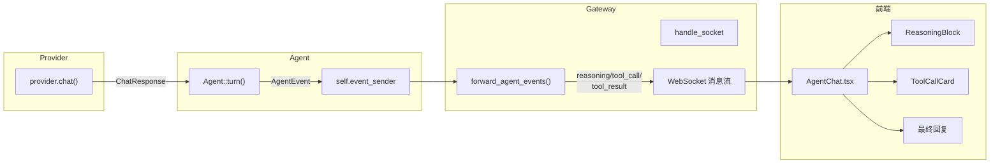

# Reasoning 与 Tool Call 用户展示方案（V2）

设计原则：**最小侵入式改动**，优先新增文件/字段/方法，避免重构现有逻辑，降低与上游合并的冲突风险。

---

## 现状分析

### 数据流断点




- Provider 层：已返回 `reasoning_content`（OpenAI/Compatible/Gemini 等均支持）
- Agent::turn()：只返回 `Result<String>`，reasoning_content 仅写入历史用于 API round-trip
- WebSocket handler：调用 `agent.turn()` 后只发送 `{type: "done", full_response}`
- 前端：`WsMessage` 类型已预留 `chunk/tool_call/tool_result`，`AgentChat.tsx` 已有处理分支，但后端从未发送
- runtime_trace：Channel 路径有完整 trace 但不含 reasoning_content；WebSocket 路径完全没有 trace

---

## 目标数据流




---

## 改动总览


| 文件                                                                             | 操作类型                                 | 合并冲突风险 | 说明                                              |
| ------------------------------------------------------------------------------ | ------------------------------------ | ------ | ----------------------------------------------- |
| [src/agent/agent.rs](src/agent/agent.rs)                                       | 结构体加字段 + 新增 setter + turn() 内插入 4 处  | 低-中低   | 不改 turn() 签名，不重构逻辑                              |
| [src/agent/mod.rs](src/agent/mod.rs)                                           | 加 1 行 pub use                        | 极低     | 纯新增                                             |
| [src/agent/loop_.rs](src/agent/loop_.rs)                                       | 2 个 json! 宏内各加 1 行                   | 中      | 在现有 payload 末尾加字段                               |
| [src/gateway/ws.rs](src/gateway/ws.rs)                                         | 加独立函数 + handle_socket 插入 3 行         | 低-中    | 逻辑提取到独立函数，主函数改动极小                               |
| [web/src/types/api.ts](web/src/types/api.ts)                                   | type 联合加 1 值 + 接口加 3 字段              | 中      | type 行修改是唯一的行级冲突点                               |
| [web/src/components/ReasoningBlock.tsx](web/src/components/ReasoningBlock.tsx) | **新文件**                              | 无      | 独立组件，不改现有文件                                     |
| [web/src/components/ToolCallCard.tsx](web/src/components/ToolCallCard.tsx)     | **新文件**                              | 无      | 独立组件，不改现有文件                                     |
| [web/src/pages/AgentChat.tsx](web/src/pages/AgentChat.tsx)                     | ChatMessage 加字段 + handler 修改 + 渲染调组件 | 中      | 新增 reasoning case，修改 tool_call/tool_result case |


---

## 详细设计

### 1. 定义 AgentEvent + Agent 结构体扩展

在 [src/agent/agent.rs](src/agent/agent.rs) 中：

**1a. 定义 AgentEvent 枚举**（文件顶部，Agent 结构体之前）

```rust
#[derive(Debug, Clone)]
pub enum AgentEvent {
    Reasoning(String),
    ToolCallStart {
        name: String,
        arguments: serde_json::Value,
    },
    ToolCallComplete {
        name: String,
        output: String,
        success: bool,
        duration_ms: u64,
    },
    Done {
        text: String,
        reasoning_content: Option<String>,
    },
}
```

**1b. Agent 结构体末尾加字段**（line 42 之后）

```rust
pub struct Agent {
    // ... 现有字段不变 ...
    response_cache: Option<Arc<crate::memory::response_cache::ResponseCache>>,
    event_sender: Option<tokio::sync::mpsc::Sender<AgentEvent>>,  // 新增
}
```

同步更新 `AgentBuilder` 和 `build()` 方法，初始化为 `None`。

**1c. 新增 setter 方法**（紧跟 `set_memory_session_id` 之后）

```rust
pub fn set_event_sender(&mut self, tx: Option<tokio::sync::mpsc::Sender<AgentEvent>>) {
    self.event_sender = tx;
}
```

**1d. 在 mod.rs 中导出**

```rust
pub use agent::{Agent, AgentBuilder, AgentEvent};
```

**合并冲突风险**：低。结构体加字段是末尾新增；setter 是新增方法；mod.rs 是行末新增。上游除非在完全相同的位置加代码，否则 git 可自动合并。

### 2. 在 turn() 内插入事件发送

不改 `turn()` 的签名和结构。在现有逻辑行之间插入 4 个小代码块，每个 3-5 行，通过 `self.event_sender` 条件发送：

**插入点 A：LLM 响应后，发送 reasoning_content**（line 623 之后）

```rust
            Ok(resp) => resp,
            Err(err) => return Err(err),
        };

        // --- 插入：发送 reasoning + runtime_trace ---
        if let Some(ref rc) = response.reasoning_content {
            if let Some(ref tx) = self.event_sender {
                let _ = tx.send(AgentEvent::Reasoning(rc.clone())).await;
            }
        }

        let (text, calls) = self.tool_dispatcher.parse_response(&response);
```

**插入点 B：无 tool calls，返回前发送 Done**（line 648 之后）

```rust
                self.trim_history();

                // --- 插入：发送 Done 事件 ---
                if let Some(ref tx) = self.event_sender {
                    let _ = tx.send(AgentEvent::Done {
                        text: final_text.clone(),
                        reasoning_content: response.reasoning_content.clone(),
                    }).await;
                }

                return Ok(final_text);
```

**插入点 C：tool calls 执行前，发送 ToolCallStart**（line 667 之后）

```rust
            self.history.push(ConversationMessage::AssistantToolCalls { ... });

            // --- 插入：发送 ToolCallStart ---
            if let Some(ref tx) = self.event_sender {
                for call in &calls {
                    let _ = tx.send(AgentEvent::ToolCallStart {
                        name: call.name.clone(),
                        arguments: call.arguments.clone(),
                    }).await;
                }
            }

            let results = self.execute_tools(&calls).await;
```

**插入点 D：tool calls 执行后，发送 ToolCallComplete**（line 668 之后）

```rust
            let results = self.execute_tools(&calls).await;

            // --- 插入：发送 ToolCallComplete ---
            if let Some(ref tx) = self.event_sender {
                for result in &results {
                    let _ = tx.send(AgentEvent::ToolCallComplete {
                        name: result.name.clone(),
                        output: result.output.clone(),
                        success: result.success,
                        duration_ms: 0, // execute_tools 不返回耗时，可后续优化
                    }).await;
                }
            }

            let formatted = self.tool_dispatcher.format_results(&results);
```

**合并冲突风险**：中低。每个插入点是独立的代码块，插在两行现有代码之间。git 三路合并能正确处理独立插入。仅当上游修改了插入点上下紧邻的行时才冲突。

### 3. runtime_trace 记录

**3a. run_tool_call_loop（Channel 路径）：在现有 trace 中补字段**

[src/agent/loop_.rs](src/agent/loop_.rs) 中 2 处 `json!` 宏：

- `llm_response`（line 2534-2542）：末尾加 `"reasoning_content": resp.reasoning_content,`
- `turn_final_response`（line 2630-2633）：末尾加 `"reasoning_content": reasoning_content,`（使用 line 2547 已有的 clone）

**3b. turn()（WebSocket 路径）：在插入点同步写 trace**

在插入点 A 和 B 中同步调用 `runtime_trace::record_event()`，使 WebSocket 路径也有完整的 trace 记录。需要在 turn() 循环开头生成一个 `turn_id`：

```rust
let turn_id = uuid::Uuid::new_v4().to_string();
```

**合并冲突风险**：中。json! 宏内加一行，与上游在同一宏内加其他字段时可能冲突，但解决极简单（保留双方字段）。

### 4. WebSocket handler

[src/gateway/ws.rs](src/gateway/ws.rs) 改动策略：**提取独立函数，最小化对 handle_socket 的修改**。

**4a. 新增独立函数 `forward_agent_events()`**（在 handle_socket 之后，tests 之前）

```rust
fn forward_agent_events(
    mut event_rx: tokio::sync::mpsc::Receiver<AgentEvent>,
    ws_tx: tokio::sync::mpsc::Sender<Message>,
) -> tokio::task::JoinHandle<()> {
    tokio::spawn(async move {
        while let Some(event) = event_rx.recv().await {
            let msg = match event {
                AgentEvent::Reasoning(content) => serde_json::json!({
                    "type": "reasoning",
                    "content": content,
                }),
                AgentEvent::ToolCallStart { name, arguments } => serde_json::json!({
                    "type": "tool_call",
                    "name": name,
                    "args": arguments,
                }),
                AgentEvent::ToolCallComplete { name, output, success, duration_ms } => serde_json::json!({
                    "type": "tool_result",
                    "name": name,
                    "output": output,
                    "success": success,
                    "duration_ms": duration_ms,
                }),
                AgentEvent::Done { .. } => continue,
            };
            let _ = ws_tx.send(Message::Text(msg.to_string().into())).await;
        }
    })
}
```

**4b. handle_socket 改动**（最小化）

改动 1：agent 初始化后加 2 行（line 132 之后）

```rust
agent.set_memory_session_id(session_id.clone());

// --- 新增：设置事件通道 ---
let (event_tx, event_rx) = tokio::sync::mpsc::channel::<crate::agent::AgentEvent>(64);
agent.set_event_sender(Some(event_tx));
```

改动 2：解决 SplitSink 不能 clone 的问题 — 用 mpsc 中转 WebSocket 写入。将 `sender` 替换为 mpsc 通道，spawn 一个写入任务：

```rust
let (ws_write_tx, mut ws_write_rx) = tokio::sync::mpsc::channel::<Message>(64);
let write_handle = tokio::spawn(async move {
    while let Some(msg) = ws_write_rx.recv().await {
        if sender.send(msg).await.is_err() { break; }
    }
});
let forward_handle = forward_agent_events(event_rx, ws_write_tx.clone());
```

改动 3：原来的 `sender.send(...)` 改为 `ws_write_tx.send(...)`（约 5 处）。

**合并冲突风险**：中。`forward_agent_events` 是新函数（无冲突）。handle_socket 的改动集中在 agent 初始化区域和 sender 写入方式变更，如果上游也改了 handle_socket 的消息发送逻辑，会需要手动合并。提取独立函数的策略已经将冲突面降到最小。

### 5. 前端类型

[web/src/types/api.ts](web/src/types/api.ts)：

```typescript
export interface WsMessage {
  type: 'message' | 'chunk' | 'tool_call' | 'tool_result' | 'done' | 'error' | 'reasoning';  // 加 'reasoning'
  content?: string;
  full_response?: string;
  name?: string;
  args?: any;
  output?: string;
  success?: boolean;       // 新增
  duration_ms?: number;    // 新增
  message?: string;
}
```

**合并冲突风险**：中。type 联合类型那一行（line 108）是行级修改，上游如果也加新类型会冲突，但解决极简单。接口新增字段在末尾，风险低。

### 6. 前端组件（新文件，零冲突）

**6a. [web/src/components/ReasoningBlock.tsx](web/src/components/ReasoningBlock.tsx)**（新文件）

折叠式 Thinking 面板：

- 默认收起，只显示 "Thinking..." 标题 + 展开箭头
- 展开后显示完整 reasoning 文本，使用较暗的字色区分
- 深色背景面板风格，与 Agent 消息气泡视觉区分

**6b. [web/src/components/ToolCallCard.tsx](web/src/components/ToolCallCard.tsx)**（新文件）

Tool Call/Result 状态卡片：

- ToolCall 状态：工具名称高亮 + 参数（代码样式，可展开）
- ToolResult 状态：成功/失败图标 + 耗时标签 + 输出摘要（可展开）
- 紧凑的卡片式布局，视觉上与聊天消息区分

**合并冲突风险**：无。全新文件，不触碰任何现有代码。

### 7. AgentChat.tsx 更新

[web/src/pages/AgentChat.tsx](web/src/pages/AgentChat.tsx) 改动：

**7a. ChatMessage 接口扩展**（line 8-13）

```typescript
interface ChatMessage {
  id: string;
  role: 'user' | 'agent';
  type: 'text' | 'reasoning' | 'tool_call' | 'tool_result';  // 新增 type
  content: string;
  toolName?: string;       // 新增
  toolArgs?: any;          // 新增
  toolOutput?: string;     // 新增
  toolSuccess?: boolean;   // 新增
  toolDuration?: number;   // 新增
  timestamp: Date;
}
```

**7b. onMessage handler 修改**

- 新增 `reasoning` case（纯新增分支）
- 修改 `tool_call` case：从拼字符串改为结构化字段
- 修改 `tool_result` case：同上
- 现有 `done`/`message`/`chunk`/`error` case 中补充 `type: 'text'`

**7c. 渲染区域**

在消息渲染的 map 中，根据 `msg.type` 条件渲染：

- `type === 'reasoning'` → `<ReasoningBlock>`
- `type === 'tool_call'` 或 `type === 'tool_result'` → `<ToolCallCard>`
- 其他 → 现有消息气泡（不变）

**合并冲突风险**：中。ChatMessage 接口修改和 handler 修改会与上游改动冲突，但渲染逻辑的主要 UI 代码在独立组件中（零冲突），AgentChat.tsx 中只是 import + 条件判断。

---

## 不改动的部分

- Provider 层：不需要修改，`ChatResponse.reasoning_content` 已经可用
- Channel 接口：`SendMessage` 和各渠道实现保持不变（Telegram/Lark/CLI 等暂不展示 reasoning）
- Observer/SSE：现有 `BroadcastObserver` 保持不变
- `turn()` 签名和主体逻辑：不改签名，不重构结构，仅在逻辑间隙插入事件发送
- `run_tool_call_loop` 主体逻辑：不修改，仅在现有 trace payload 末尾加一个字段

---

## 合并冲突风险总览


| 文件                          | 风险等级 | 降冲突措施                                                |
| --------------------------- | ---- | ---------------------------------------------------- |
| src/agent/agent.rs          | 中低   | 不重构 turn()，只插入独立代码块；字段和方法都是纯新增                       |
| src/agent/mod.rs            | 极低   | 行末加 1 行 pub use                                      |
| src/agent/loop_.rs          | 中    | 仅在 json! 宏末尾加字段，不改结构                                 |
| src/gateway/ws.rs           | 中    | 提取 forward_agent_events() 为独立函数，handle_socket 改动降至最小 |
| web/src/types/api.ts        | 中    | type 行级修改不可避免，但解决极简单                                 |
| web/src/components/*.tsx    | 无    | 全新文件                                                 |
| web/src/pages/AgentChat.tsx | 中    | UI 逻辑提取到独立组件，主文件改动减少                                 |


